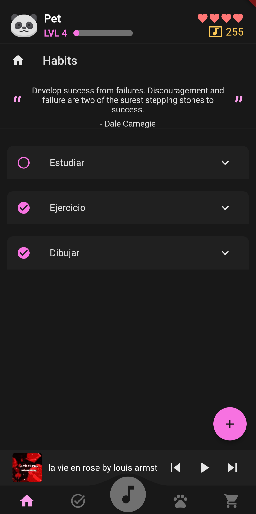
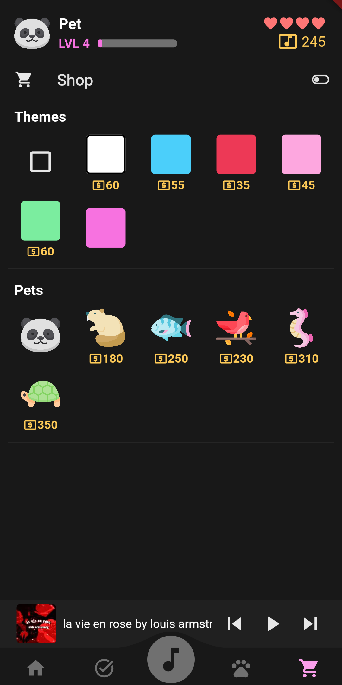

# HabitHarmony

HabitHarmony is a motivation app that helps you build habits using music as a motivador!
You can associate specific songs to certain habits and tasks and then reproduce them as
a playlist

## Features

* Music reproductor
* Habits tracker with specific music 
* Tasks tracker with specific music
* Sub tasks with specific music
* Custom playlist
* Daily motivation quotes
* Highly customizable with multiple pets & themes
* A pet that levels up when you complete a habit
* Background music

## Screenshots

### Habits 



### Tasks


### Music


### Reproductor


### Playlist


### Pet


### Shop



### Habits with certain music


### Themes and pets!


### How to run

#### Install the app in your phone

You can install the app in your phone using the executable found in the [releases](https://github.com/zYakro/habitharmony/releases)

#### Run the app locally

You'll need [Flutter](https://docs.flutter.dev/get-started/install) and [Dart](https://dart.dev/get-dart) installed

1. Clone the repository

```bash
  git clone https://github.com/zYakro/habitharmony.git
```

2. Go to the project folder

```bash
  cd habitharmony
```

3. Install the dependencies

```bash
  flutter pub get
```

4. Run

```bash
  flutter run
```

You'll need a physical device to run the app, or use Android Studio